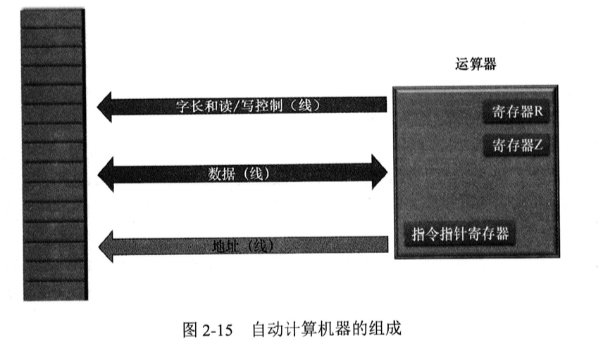

# 第 2 章 计算机和汇编语言

|本期版本|上期版本|
|:---:|:---:|
`Wed Apr 17 10:17:47 CST 2024` | -

## 2.3 具有记忆功能的器件 - 寄存器

* 一个**触发器**只能保存 1 比特
* 使用若干个触发器，将它们组合在一起，这样就形成形成了一个新的器件，叫作**寄存器(Register)**

## 2.6 机器指令

* 我们把这些开关所代表的数字叫作**指令(Instruction)**
* 指令就是给这台机器下达的操作命令

## 2.7 内存

* 在主流计算机的内存里，每个**内存单元的长度是8比特**，可以保存一个8位二进制数
* 每个内存单元都有一个唯一的编号。单元的编号是这个单元在内存里的位置，通常称为**地址(Address)**
* 内存使用一排电线，称为**地址线1**，来指定单元的编号
* 内存单元的编号就是它的地址，习惯上，我们用**十六进制标注在它的左侧**
* 字节是用来描述二进制序列的长度单位，8比特组成1字节。字节的英文单词是Byte,简写为B
* 内存上还需要另一排导线，这排导线叫作**数据线2**
	* 要写入的数据通过数据线进入内存；读出来的数据也通过数据线送到外面
* 还需要一个**读写控制线3**，用来指明是读操作还是写操作

## 2.8 自动计算

* 运算器内部有一个**指令指针寄存器**，这个寄存器保存着指令的地址。
* 可以根据当前这条指令的地址和长度来计算下一条指令的地址。
* **操作码**、**操作数**
* 如果这个数已经在指令中给出了，不需要再次访问内存，那么这个数是**立即数**

## 2.9 处理器

* 任何一款处理器，它可以识别的所有指令的集合，叫作这款处理器的**指令集**
* 算数运算指令1、逻辑运算指令2、数据传送指令3和处理器状态控制指令4