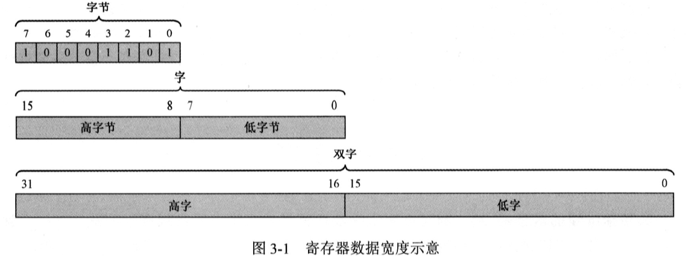
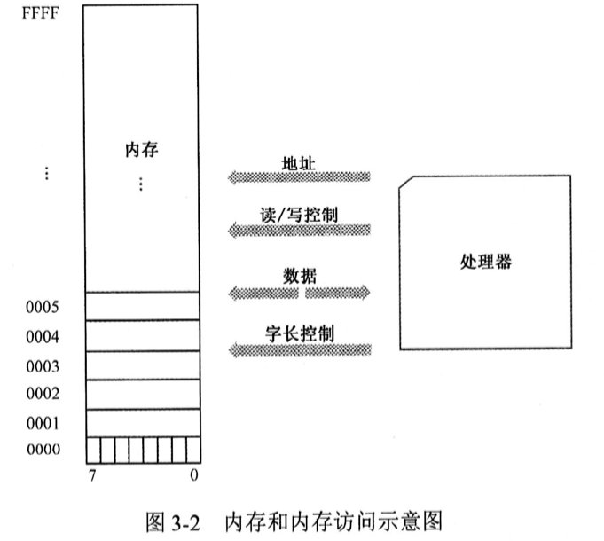

# 第 3 章 分段机制和逻辑地址

|本期版本|上期版本|
|:---:|:---:|
|`Sun Feb 11 12:27:25 CST 2024`| -

## 3.1 寄存器和字长

**8位**

* 8 位寄存器可以容纳8比特，或者说 1 字节(Byte)
* 编号从右往左进行的，从0开始，分别是0、1、2、3、4、5、6、7
* 位0（第1位）是最低位，在最右边；位7（第8位）是最位，在最左边。

**16位**

* 16位寄存器可以存放2个字节，这称为1个字（word），各个数位的编号分别是 0~15
* 0~7 是低字节，8~15 是高字节

**32位**

* 32位寄存器可以存放4字节，这称为1个双子（double word）,各个数位的编号分别是 0~31
* 0~15 是低字，16~31 是高字

## 3.2 内存访问和字节序

* 内存按字节来组织，单次访问的最小单位是1字节
*  每个存储单元中，各位的编号分别时0 ~ 7
* 内存中的每个字节都对应着一个地址
* 如果访问内存中的一个字，那么，他规定高字节位于高地址部分，低字节位于低地址部分，这称为低端字节序列（Little Endian）

## 3.3 古老的 Intel 8086 处理器

**3.3.2 程序的重定位难题**

* 指令和数据要分开存放，分别位于中的不同区域，或者说个字形成一个段(Segment),分别叫代码段和数据段
* 在指令中使用了绝对内存地址（物理地址），这样的程序是无法重定位的

**3.3.3 逻辑地址**

* 起始地址就是**段地址**
* 相对于段开始处的距离，叫做**偏移地址**
* 一个内存单元地址可以用 **段:偏移**或者**段地址:偏移地址**来表示，这就是通常所说的**逻辑地址**
* **当处理器访问内存时，它把指令中指定的内存地址看成是段内的偏移地址而不是物理地址**

**3.3.4 8086 的内存分段机制**

* 当一段代码开始执行时，CS指向代码段的起始地址，IP则指向段内偏移
* 先将段寄存器的内容左移4位（相当于乘以十六进制的10，或者是进制的16），形成20的段地址，然后在同16位的偏移地址相加，得到20位的物理地址
* 偏移地址总要求从 0000H 开始
* 8086 处理器的逻辑分段，起始地址都是16字的倍数，这称为是按16字节对齐的
