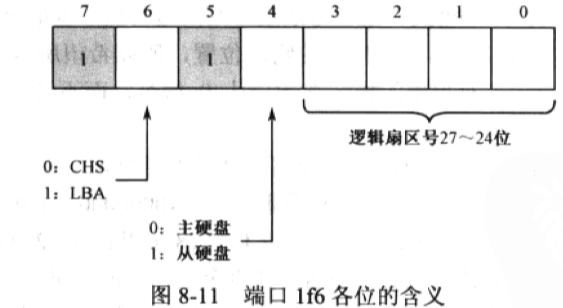
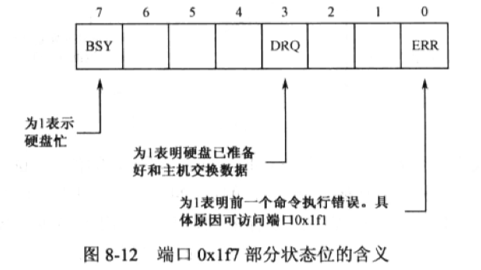
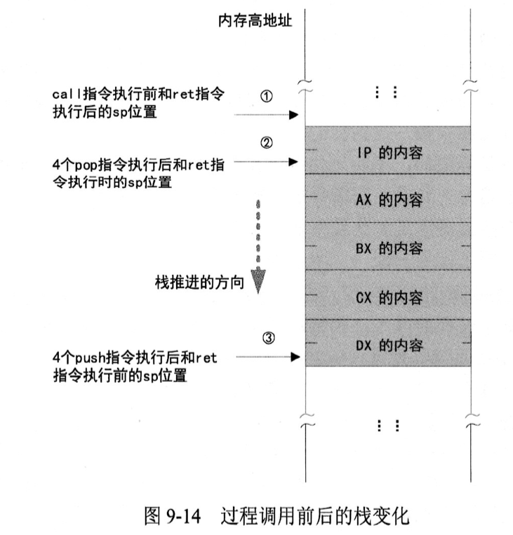

# 第 9 章 硬盘和显卡的访问控制

|本期版本|上期版本
|:---:|:---:|
`Thu Apr 11 19:17:45 CST 2024` | 

## 9.2 用户程序的结构

### 9.2.1 分段、段的汇编地址和段内汇编地址

* NASM 编译器使用汇编指令 `SECTION` 或者 `SEGMENT` 来定义段
* 一旦定义段，那么，后面的内容就都属于该段，除非又出现另一个段的定义
* 指定段的对其方式，应该使用 `align=` 子句，并指定一个具体的对齐
* **段的汇编地址其实就是段内第一个元素到整个程序起始处的距离(`section.段名称.start`)**
* 为了将一个段对齐与特定的汇编地址，可能需要在他前面的那个段内填充数据
* `vstart=0` 汇编地址要从它所在的段的开头开始计算，而且是从0开始计算


### 9.2.2 用户程序头部

* 用户程序的尺寸，即以字节为单位的大小
* 用户程序的入口点，包括段地址和偏移地址
* 段重定位表

## 9.3 加载程序（器）的工作流程

### 9.3.1  初始化和决定加载位置

* 从那个物理内存地址开始加载用户程序
* 用户程序位于硬盘上的什么位置, 它的起始逻辑扇区号时多少
* 常数是用伪指令 `equ` 声明的， 它的意思是等于


### 9.3.2 准备加载用户程序

* 段内所有元素的汇编地址都将从 `0x7c00`开始计算
* **将该物理地址变成16位的段地址**

### 9.3.4 I/O端口和端口访问

* 处理器是通过端口来和外围设备打交道的。本质上，端口就是一些寄存器
* 内存映射、独立编址
* 主硬盘分配的端口号是`0x1F0`~`0x1F7`。副硬盘分配的端口号是`0x170`~`0x177`


**`in` 指令是从端口读**

> 一个字节


```s
in al, dx   ; 0xEC
in ax, dx   ; 0xED 
```

* 目的操作数必须是寄存器AL(8位)或者AX(16位)
* 源操作数应当是寄存器DX，用来指定端口号

> 两个字节

```asm
in al, 0xf0	; 0xE4 F0(8位)
in ax, 0x03	; 0xE5 03(16位)
```

* 后一个字节是立即数，指示端口号

**`out` 指令是通过端口向外围设备发生数据**

* 目的操作数可以是8位立即数或者寄存器DX
* 源操作数必须是寄存器AL或者AX


## 9.3.5 通过硬盘控制器端口读扇区数据

* LBA28 使用28比特来表示逻辑扇区号

> [15 硬盘读写](https://www.bilibili.com/video/BV1b44y1k7mT?p=15)

| Primary 通道            | Secondary 通道 | in 操作      | out 操作     |
| ----------------------- | -------------- | ------------ | ------------ |
| 0x1F0                   | 0x170          | Data         | Data         |
| 0x1F1                   | 0x171          | Error        | Features     |
| 0x1F2                   | 0x172          | Sector count | Sector count |
| 0x1F3                   | 0x173          | LBA low      | LBA low      |
| 0x1F4                   | 0x174          | LBA mid      | LBA mid      |
| 0x1F5                   | 0x175          | LBA high     | LBA high     |
| 0x1F6                   | 0x176          | Device       | Device       |
| 0x1F7                   | 0x177          | Status       | Command      |


**1 - 准备阶段**

* 读取扇区的数量: `0x1f2`(每读一个扇区，这个数值就减一)
* 28位的扇区号: `0x1f3`、`0x1f4`、`0x1f5`、`0x1f6`



```
; 寄存器AH的低4位是起始逻辑扇区号的27-24位，高位是全0
; 寄存器AL中是0xe0
mov al, 0xe0; 1110 0000

; 会在寄存器AL中得到他们的组合值， 高4位是0xe0, 低4位是逻辑扇区号的 27-24位
or al, ah
```

**2 - 等待阶段**

*  向端口 `0x1f7` 写入 `0x20` ，请求硬盘读
* `0x1f7` 既是命令端口，又是状态端口



```
and al, 0x88 			;10001000 保留第7位和第3位， 其他无关的位都清零
cmp al, 0x08			;00001000 可以退出等待状态，继续往下操作，否则继续等待
```

**3 - 获取数据阶段**

* `0x1f0` 是硬盘的数据端口，而且是一个 16 位端口

## 9.3.6 过程调用

**参数传递最简单的办法是通过寄存器**

* 起始逻辑扇区号分成`高12位`和`低16位`两部分
* 高12位左侧加0扩展到16位，存放在寄存器`DI`中，低16位存放在寄存器`SI`中
* 读出来的数据存放到段寄存器`DS`指向的数据段中，起始偏移地址在寄存器`BX`中
* **寄存器临时压栈，并在返回到调用点之前出栈恢复**


---
**8086 处理器支持四种调用方式**

> 第一种是16位相对近调用

* 三字节指令，操作码为 `0xE8`, 后跟16位的操作数
* 操作数是当前call指令相对于目标过程的**偏移量**
* 用目标过程的汇编地址，减去当前call指令的下一条指令的汇编地址
* 使用关键字 `near`, 不是必须的，没有关键字默认为近调用

**执行过程**

* 它用IP的当前内容(它已经指向下一条指令)加上指令中的操作数，得到一个新的偏移地址
* 将IP的原有内容压入栈
* 用刚才计算出的偏移地址取代IP的原有内容

> 第二种是16位间接绝对近调用

* 操作数不是偏移量，而是被调用过程的真实偏移地址，故称为绝对地址
* 由寄存器或者内存单元间接给出

> 第三种是16位直接绝对远调用

* 16位是针对偏移地址来说的，而不是限定段地址
* 段地址和偏移地址直接在call 指令中给出了
* 偏移地址在前，段地址在后


> 第四种是16位间接绝对远调用

* 段地址和偏移地址是间接给出的
* 偏移地址在前，段地址在后

```asm
; 间接远调用必须使用关键字 far
call far [0x2000]
```
---

> 过程返回

* 过程执行完了呢，还得返回到调用点继续执行下一条指令，这称为**过程返回(Procedure Return)**
* `ret`和 `retf` 经常用做 `call` 和 `call far` 的配对指令
* `ret` 是近返回指令，从栈中弹出一个字到指令指针寄存器IP中
* `retf` 是远返回指令，从栈中弹出两个字到指令指针寄存器IP和代码段寄存器CS中
* **`ret`/ `retf` 指令却并不依赖与 `call` 指令**




### 9.3.7 加载用户程序

* `jnz` 不相等则跳转 / `jz` 相等则跳转
* 一个逻辑段最大也才 64 KB， 当用户程序特别大的时候，根本容纳不下
* **每次往内存中加载一个扇区前，都重新在前面的数据尾部构造一个新的逻辑段，并把要读取的数据加载到这个新段内**
* 每个段的大小是 `512` 字节，即十六进制的 `0x200`，右移4位后是 `0x20`

### 9.3.9 用户程序重定位

* 用户程序都已经全部加载到内存里了，而且是从物理地址 `phy_base` 开始的
* 低16位加到寄存器AX中(add), 高16位加到寄存器DX中(adc)


---

> `calc_segment_base` （计算段基地址)

* 我们已经在DX:Ax中得到了入口点代码段的起始物理地址，只需要将这个32位数右移4位即可得到逻辑段地址

**分别移动然后拼接**

* 逻辑右移指令shr将寄存器AX中的内容右移4位
* 循环右移ror（演示指令如何使用)
* **尽管 `DX:AX` 中是 32 位的用户程序起始物理内存地址，理论上，它只有 20 位是有效的， 低 16 位在寄存器 AX中，高 4 位在寄存器 DX 的低 4 位**


### 9.3.9 将控制权交给用户程序

* 加载器通过一个16位的间接绝对远转移指令，跳到用户入口点

### 9.3.10 8086 处理器的无条件转移指令

**1) 相对短转移**

* 操作数是相对于目标位置的偏移量
* 必须使用关键字 `short`

**2) 16位相对近转移**

* 操作数是相对于目标位置处的偏移量
* 应当使用关键字 `near`

**3) 16位间接绝对近转移**

* 用一个16位的通用寄存器或者内存地址间接给出来的

**4) 16 位直接绝对远转移**

* 段地址:偏移地址

**5) 16位间接绝对远转移**

* 目标地址可以通过访问内存来间接得到


## 9.4 用户程序的工作流程

### 9.4.1 初始化段寄存器和栈切换

* `resb（Reserve Byte）`: 从当前位置开始，保留指定数量的字节，但不初始化他们的值


### 9.4.2 调用字符串显示例程

* 将字车推到最左边， 也就是一行的开始，叫做回车(Carriage Return)。拧一下滚动，将纸上卷一行，叫作换行(Line Feed)
* 这个过程通常叫做回车换行(CRLF)
* 回车分配的 ASCII 码是 `0x0d`, 换行分配的则是 `0x0a`
* 数值0, 用来标志字符串的结束，这样的字符串称为是 `0` 终止的字符串

### 9.4.3 过程的嵌套

* 循环从DS:BX中取得单个自负，判断它是否为0
* 不为0则调用另一个过程 put_char 来显示这个字符，为0则返回主程序

**9.4.4 屏幕光标控制**

* 光标是在屏幕上有规律地闪动的一条小横线
* 光标在屏幕上的位置保存在显卡内部的两个光标寄存器中，每个寄存器是 8 位，合起来形成一个 16 位的数值
* 光标寄存器是可读写的


**8.4.5 取当前光标的位置**

* 很多寄存器只能通过索引寄存器间接访问
* 索引寄存器的端口号是 `0x3d4`
* `14(0x0e)` 和 `15(0x0f)` 粉笔用于提供光标位置的高8位和低8位
* 要对它进行读写，这可以通过数据端口: `0x3d5`

**8.4.6 处理回车和换行字符**

* 如果是回车符 `0x0d`, 那么，应将光标移动道当前行首：用当前光标位置除以80，可以得到当前行数，接着再乘以 80， 就是当前行行首的光标数值
* 换行的意图是向下一行，只需增加 80 即可得到新的光标位置数据


### 8.4.8 滚动屏幕内容

*  实质上就是将屏幕上 2\~25行的内容整体往上提一行，最后用黑底白字的空白字符填充低25行


### 9.4.10 切换到另一个代码段中执行

* 可以使用 `retf` 来模拟段间的返回
* **尽管 `call` 和 `call far` 指令分别依赖 `ret` 和 `retf` 指令, 单后者并不依赖与前者**

## 9.5 编译和运行程序并观察结果

```bash
dd if=c08_mbr.bin of=c.img bs=512 count=1 conv=notrunc
dd if=c08.bin of=c.img seek=100 bs=512 count=1 conv=notrunc
```
