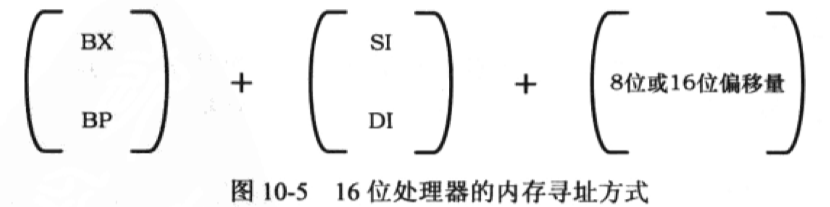
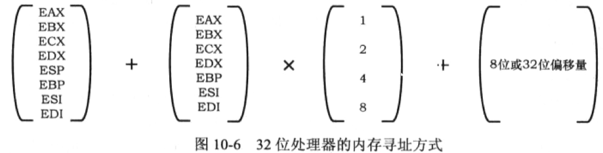

# 第 11 章 32位 x86处理器编程架构

|本期版本|上期版本
|:---:|:---:|
`Wed Aug 21 11:59:22 CST 2024` | `Fri Apr 19 18:36:55 CST 2024`

> INTEL 32位处理器架构简称 IA-32

## 11.1 IA-32架构的基本执行环境

* 32 位通用寄存器的高16位是不可独立使用的，但低16位保持同16位处理器的兼容
* **平坦模型(Flat Mode)**: 只分一个段，段的基地址是 0x00000000，段的长度是 4GB
* 在32位模式下，传统的段寄存器保存的不再是16位段基地址，而是段的`选择子`，即，用于选择所要访问的段

### 11.1.2基本的工作模式

* 真正的段地址位于段寄存器的描述符高速缓存中，是24位的
* **在刚加电时，这些处理器自动处于实模式下，此时，它相当于一个非常快速的8086处理器，只有在进行一番设置之后，才能运行在保护模式下**
* 可以将整个4GB内存定义成一个段来处理，这就是所谓的`平坦模式`

###  11.1.3 线性地址和分页

* 传统上，段地址和偏移地址称为**逻辑地址**，偏移地址叫做**有效地址（Effective Address， EA）**， 在指令中给出有效地址的方式叫做**寻址方式(Addressing Mode)**
* 一般来说，段部件产生的地址就是**物理地址**
* 分页功能将物理内存空间划分成逻辑上的页。页的大小是固定的，一般为 4KB
* 当页功能开启时，段部件产生的地址就不再是物理地址了，而是**线性地址(Linear Address)**, 线性地址还要经过页部件转换后才是物理地址

## 12.2 现代处理器的结构和特点

### 11.2.5 分支目标预测

* 一个典型的情况是，如果遇到一条转移指令，则后面那些已经进入流水线的指令就都无效了
* 换句话说，我们必须清空（Flush）流水线，从要转移到的目标位置处重新取指令放入流水线

## 11.3 32 位处理器的寻址方式

允许使用基址寄存器 `BX`或者`BP`,同变址寄存器 `SI`或者`DI`结合，在加上8位或者16位的位移来寻址内存操作数

* 变址寄存器还允许乘以1、2、4或者8 作为比例因子

