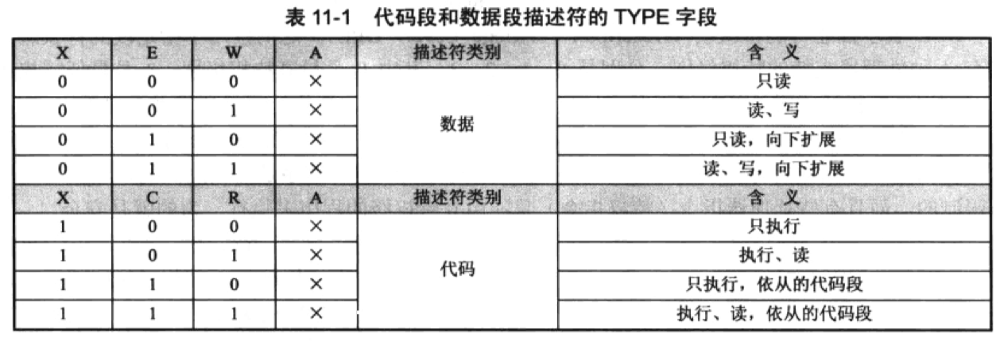
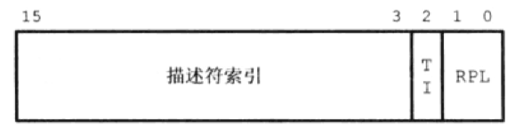

# 第 12 章 进入保护模式

|本期版本|上期版本
|:---:|:---:|
`Sat Apr  6 23:38:44 CST 2024` | 

## 12.2 全局描述符表

* 和一个段有关的信息需要 `8个字` 节来描述，所以称为**段描述符(Segment Descriptor)**
* 最主要的描述符表是**全局描述符表(Global Descriptor Table， `GDT`)**
* 为了跟踪全局描述符表，处理器内部有一个 `48位` 的寄存器，称谓**全局描述符表寄存器（`GDTR`）**
	* `32位` 线性基地址保存的是全局表述符表在内存中的起始线性地址
	* `16位` 边界部分保存的是全局描述符表的边界，其数值上等于表的大小（总字节数）减一。界限值就是表内最后 1 字节的偏移量
* 由于在实模式下只能访问 1MB的内存，故 GDT通常都定义在 1MB以下的内存范围中

## 12.3 存储器的段描述符


* 我们决定把GDT设在主引导程序之后，也就是物理地址 `0x00007E00` 

```
0x7C00 + 0x200(512) = 0x7E00
```

* 描述符不是由用户程序自己建立的，而是在加载时，由操作系统根据你的程序结构而建立的，而用户程序通常时无法建立和修改GDT的

---

**描述符**

> [「Coding Master」第28话 从实模式到保护模式的切换代码](https://www.youtube.com/watch?v=EkzleCAIdXg&list=PLLBMaJy_MOpM2xUPbjSBSib7hUUaaEGa6&index=30)

* 下面是低 32 位， 上面是高 32 位
* 在 32 位保护模式下，段地址是 32 位的线性地址，如果未开启分页功能，该线性地址就是物理地址
* **32位处理器为了保持同80286的兼容，只能在旧的描述符格式进行扩充，这是不得已的做法**


**DPL**

* DPL表示描述符的特权级(Descriptor Privilege Level, DPL), 共有4中处理器支持的特权级别，分别是 0、1、2、3，其中`0`是最高阶别，`3`是最低级别
* 刚进入保护模式时执行的代码具有最高特权级 `0`
* 描述特权级用于指定访问该段所必须具有的最低特权级




### 12.4 安装存储器的段描述符并加载GDTR

* 必须将GDT的线性地址转换成逻辑段地址和偏移地址
* 处理器规定， GDT 中的第一个描述符必须是空描述符
* `lgdt` 从指定内存地址处加载6个字节数据
* `lgdt m48` 操作数是一个 48 位的内存区域: 低16 是界限值，高 32 位是基地址

### 12.5 关于第 21 条地址线 A20 的问题

* A20 就是第 21 跟地址线
* 每次当地址到达最高端 `0xFFFFF` 时，再加1， 结果为 `0x100000`
* 端口: `0x92` 的位 1 用于控制 A20， 叫做 Fast A20


### 12.6 保护模式下的内存访问

* 控制这两种模式切换的开关原是在一个叫 CR0 的寄存器， 它的第一位（位0）是保护模式的允许位
* 每个段寄存器包括了一个不可见的部分，称为**描述符高速缓存器**, 用来存放段的线性基地址、段界限和段属性
* 在保护模式下，尽管访问内存时也需要指定一个段，但传送到段选择器的内容不是逻辑段地址，而是段描述符在描述符表中的索引
* TI=0 时，表示描述符在GDT中
* 描述符在表内的偏移地址是索引号乘以 8 



### 11.7 清空流水线并串行优化处理器


* 处理器最怕转移指令，遇到这种指令，一般会清空流水线，并串行优化; 另一方面，远转移会重新加载段选择器 CS， 并刷新描述符高速缓存器中的内容
* 一个建议的方法是在设置了控制寄存器CR0的PE位之后，立即用jmp或者call转移到当前指令流的下一条质量上
* `[bits 32]`

## Ref

* 