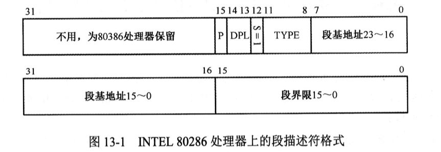
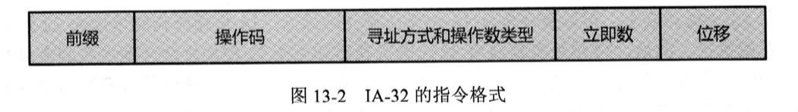

# 第 13 章 操作数和有效地址的尺寸


|本期版本|上期版本
|:---:|:---:|
`Mon Apr 15 22:13:58 CST 2024` | 

* 为了区分这两种不同操作尺寸的指令，32位处理器引入了**默认操作尺寸**的概念


## 13.2 INTEL 808286 处理器的16位保护模式

* 80286 第一次引入了保护模式
* 80286 有24根地址线，可以访问16MB的内存
* **32位处理器的描述符格式是从80286进化来的**




## 13.3 指令的操作尺寸

* 所谓**操作尺寸**，是指操作的`数据长度`及指令在访问内存时的`有效地址长度`

### 13.3.3 默认操作尺寸

* **让16位操作尺寸的指令和32位操作尺寸的指令使用相同的编码**
* 32 位处理器上，指令如何解释和执行，取决于CS描述符高数缓存器中的D位
* 在处理器刚加电的时候，它由处理器的固件设置位0




### 13.3.4 操作尺寸反转前缀

```
89 C8
```

如果当前默认的操作尺寸是16位的，即，CS描述高速缓存器中的D位是0

```s
mov ax, cx
```

如果当前默认的操作尺寸是32位的，即，CS描述高速缓存器中的D位是1

```s
mov eax, ecx
```

* **指令前缀 `0x66` 具有反转当前默认操作数大小的作用**
* **前缀 `0x67` 则用来反转有效地址尺寸**

### 13.5.5 编译时的操作尺寸

* 答案你必须知道！你是一个汇编语言程序员，是处理器的控制者，处理器在什么时候处于什么状态，你必须清楚，而且你最清楚
* `bits 16` 通知编译器，编译后面的指令时，应当假设处理器的默认操作尺寸是16位
* **可以放在方括号中，也可以没有方括号**


## 13.4 清空流水线并串行优化处理器

* 在保护模式下执行元转移指令将导致段寄存器CS被修改，同时CS描述符高速缓存器的内容要用描述符的内容刷新
* jmp指令的执行，导致处理器清空流水线
* CS描述符高速缓存器中的D位决定了处理器使用IP还是EIP来取指令和执行指令


## 13.5 有效地址尺寸和内存访问

---

> 16位指令和32位指令共用相同的指令码，但通过不同的指令前缀，结合当前的运行转台来决定指令的寻址方式


前缀`0x66` | 16位模式 | 32 位模式
--- | --- | --- 
没有 | 16 位寻址 | 32位寻址
有  | 32位寻址  | 16位寻址

## 10.3.2 操作数大小的指令前缀

* 相同的机器指令，在16位模式下和32位模式下的解释和执行效果是不同的
* 当处理器在16位模式下运行时，也可以使用32位的寄存器，执行32位的运算
* 指令前缀 0x66 具有反转当前默认操作数大小的作用
* 在16位模式下，处理器把所有指令都看成是16位的
* 编译器提供了 伪指令 `bits` 用于指明其后的指令应该被译为 16 位还是32 位
* `bits 16` 或者 `bits 32` 可以放在方括号中，也没有方括号
* 16 位模式是默认的编译模式