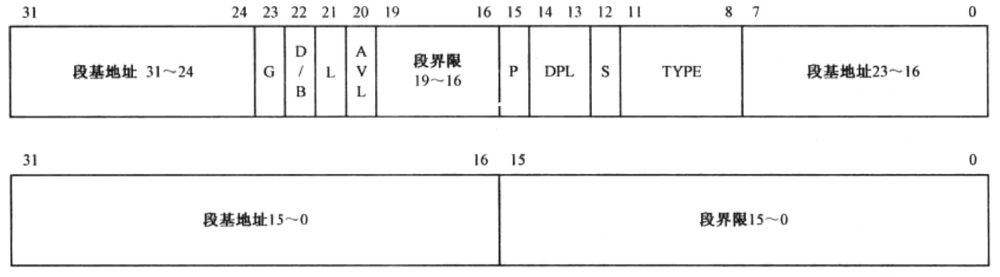

# 第 15 章 程序的动态加载和执行

|本期版本|上期版本
|:---:|:---:|
`Fri Aug 23 12:40:24 CST 2024` | `Mon Apr 15 22:47:44 CST 2024`

## 15.2 内核的结构、功能和加载

### 15.2.2 内核的加载

* 如果当前的默认操作尺寸时32位的，执行loop指令需要使用的寄存器ECX，而不是CX

### 15.2.3 安装内核的段描述符

* 还要为 GDT 继续添加新的描述符
	* 重新从标号pgdt 处取得GDT的基地址
	* 我们拥有一个指向全部4G内存空间的描述符
	* 内核被加载的物理地址是由EDI寄存器指向的

```
mov eax,0x0008                     ;加载数据段(0..4GB)选择子
         mov ds,eax

mov esi,[0x7c00+pgdt+0x02]         ;不可以在代码段内寻址pgdt，但可以
                                            ;通过4GB的段来访问

  ;建立公用例程段描述符
         mov eax,[edi+0x04]                 ;公用例程代码段起始汇编地址
         mov ebx,[edi+0x08]                 ;核心数据段汇编地址
         sub ebx,eax
         dec ebx                            ;公用例程段界限 
         add eax,edi                        ;公用例程段基地址
         mov ecx,0x00409800                 ;字节粒度的代码段描述符
         call make_gdt_descriptor
         mov [esi+0x28],eax
         mov [esi+0x2c],edx
```


---



**段的信息只有在程序运行的时候才能确定**

参数|寄存器
---|---
 线性基础地址 | EAX
 段界限 | EBX(只用其低20位)
 段属性|ECX(与描述符布局一致)
 
**构造低32位**
 
 * 将寄存器EAX中的32位基地址左移16次，使基地址部分就位
 * 把寄存器BX中的段界限用or指令安排就位

**构造高32位**

```s
; 先清除EBX的低16位，然后同寄存器EDX合并
; xor bx, bx	; 假设寄存器EBX的高12 位全为0
and ebx 0x000f000
or edx, ebx
```

## 15.3 在内核中执行

* 指令 `pushad`，在32位操作尺寸下执行该指令时，处理器会自动按顺序压入 EAX、ECX....相应的，在返回时，使用了 `popad`

传送指令

16位|32位
---|---
DS:SI / ES:DI | DS:ESI / ES:EDI

---
处理器品牌信息(TODO)

* `cpuid` 指令用于返回处理器的标识信息和特性信息
* `cpuid` 指令时80486处理器的后期版本开始引入的
* `EFLAGS` 寄存器，它的ID标识位（位21）如果为`0`，则不支持 cpuid(一般情况下不检测)
* EAX / EBX / ECX


## 15.4 用户程序的加载和重定位

* 内核还应当提供一些例程供用户程序调用
* 在表格中列出所用到的符号名。每个符号名的长度时256字节，不足部分用 `0x00` 填充
* 在用户程序加载后，内核会分析这个表格，并将每个符号名换成相应的内存地址，这就是重定位


### 15.4.2 计算用户程序占用的扇区数

* 用户程序的起始逻辑扇区号
* 数据存放地点是内核缓冲区 core_buf

### 15.4.3 简单的动态分配内存


* 通过寄存器ECX传入希望分配的字节数。当过程返回时，寄存器ECX包含了所分配内存的起始物理地址
* 标号 `ram_alloc` 并初始化一个爽字 `0x0010 0000` ,这就是可用于分配的厨师内存地址

### 15.4.4 段的重定位和描述符的创建
 
 ```
sgdt m
 ```

