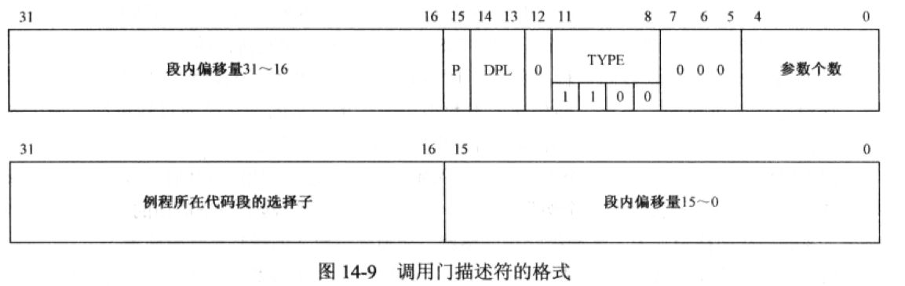
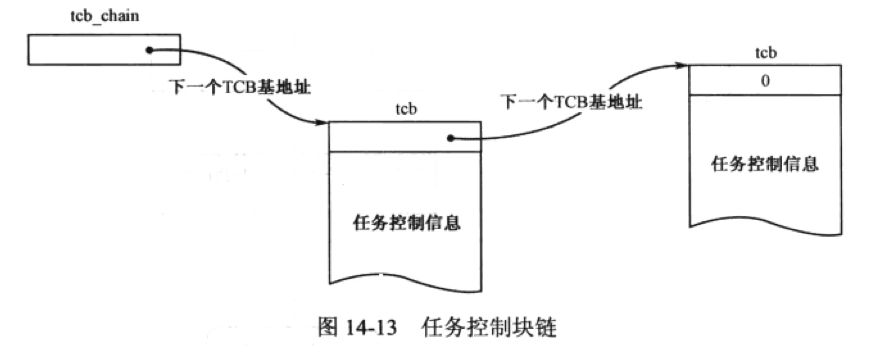

# 第 16 章 任务和特权级别

##  16.1 任务的隔离和特权级保护

### 16.1.1 任务、任务的LDT和TSS

* 局部描述符表(Local Descriptor Table, `LDT`) / 局部描述符表寄存器(LDT Register, `LDTR`)
	* LDT的第一个描述符，也就是0号槽位也是有效的，可以使用
	* 因为寄存器LDTR只有一个，所以只用指向当前任务的LDT
	* 和GDTR一样，LDTR包含了32位线性地址字段和16位段界限字段
* 任务状态段(Task State Segment, `TSS`) / 任务寄存器(Task Register, `TR`)
	* 当任务切换发生时，必须保护旧任务的运行状态，或者说是保护现场
	* 每个任务都应当用一个额外的内存区域保存相关信息，叫作任务状态段
	* 任务状态段具有固定的格式，最小尺寸是 104字节
	* 处理器用TR寄存器指向当前任务的TSS

	
### 16.1.2 全局空间和局部空间

* 当任务执行自己的代码时，它处于用户态；当任务需要使用内核的服务时，需要进入内核的代码执行，此时处于内核态
* 每个任务实际上包括了两个部分：全局部分和私有部分
* 所谓的全局部分和私有部分，其实是地址空间的划分，即全局地址空间和局部地址空间，简称全局空间和局部空间

### 14.1.3 特权级保护概述

* 特权级(Privilege Level) / 描述符特权级(Descriptor Privilege Level, DPL) / 当前特权级(Crruent Privilege Level, CPL)
* Intel 处理器可以识别4个特权级别，分别是0到3，较大的数值意味着较低的级别

### 调用特权级高的操作系统例程

**1 - 将高特权级的代码段定义为依从**

* 要求当前特权级CPL必须低于或者和目标代码段描述的DPL相同
* 不改变当前特权级CPL

**2 - 门描述符**

* `jmp far` 不改变当前特权级
* `call far` 提升当前特权级
* 进入保护模式之后，处理器自动将当前特权级CPL设定为0

**3 - RPL**

> 每当处理器执行一个将段选择子传送到段寄存器的指令

* 当前特权级CPL高于或者和数据段描述符的DPL相同
* 请求特权级RPL高于或者和数据段描述符的DPL相同

**检查规则**

* 将控制直接转移到非依从的代码段，要求当前特权级CPL和请求特权级RPL都等于目标代码段描述符的DPL
* 将控制直接转移到依从的代码段，要求当前特权级CPL和请求特权级RPL都低于，或者和目标代码段描述符的DPL相同。（当前特权级保持不变)
* 高特权级别的程序可以访问低特权级别的数据段，但低特权级别的程序不能访问高特权级别的数据段
* 在任何时候，栈段的特权级别必须和当前特权级CPL相同

### 14.3 内核程序的初始化

**14.3.1 调用门**

* 描述符中的TYPE字段用于标识门的类型，共4比特，值 `1100` 表示调用门

### 14.4 加载用户程序并创建任务

**14.4.1 任务控制块和TCB链**

* 内核应当为每一个任务创建一个内存区域， 来记录任务的信息和状态，称为任务控制块(Task Control Block, TCB)

* 为了能够追踪到所有任务，应当把每个任务控制块 TCB 串起来, 形成一个链表

**14.4.2 使用栈传递过程参数**

* 用户程序的起始逻辑扇区 / 任务控制块TCB线性地址

**14..4.3 加载用户程序**

### 14.5 用户程序的执行